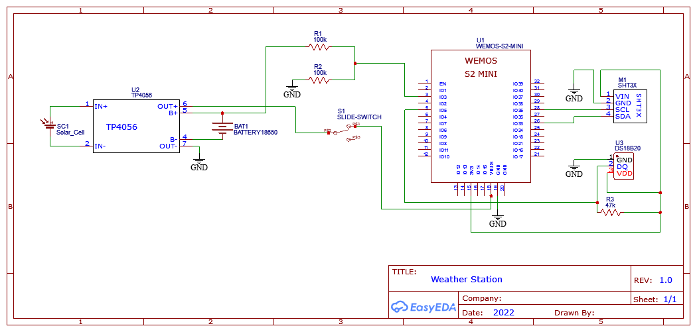
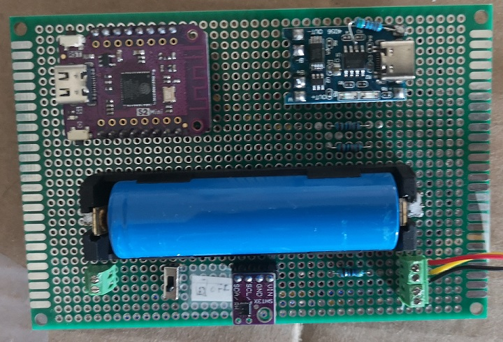
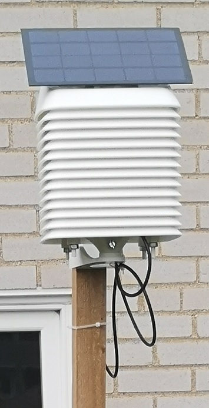

# Weather Station
A solar powered weather station that collects data from various sensors. The data is send to an influx db for storage and further usage, e.g. for my weather display.

OTA update is supported in a pull mode; the ESP will check each wake up cycle if a newer firmware version is available and if so updates itself. Else the regular routine of collecting weather data and sending it to influx is executed.

This is v1 with limited sensor support, in later versions more sensors will be added.

## Parts
<ul>
  <li>Lolin Wemos S2 Mini</li>
  <li>SHT31 - temperature and humidity sensor</li>
  <li>DS18B20 - outdoor proof temperature sensor</li>
  <li>5V solar cell</li>
  <li>TP4056 - BMS</li>
  <li>18650 battery + holder</li>
  <li>proto board</li>
  <li>Switch - for on/off</li>
  <li>various resistors</li>
  <li>wires</li>
  <li>Stevenson screen - housing</li>
</ul>

Your local electronic store should have most if the items, the rest can be found on Aliexpress.
I used a Stevenson screen that I found on Thingiverse and customized to my needs.

Note that the TP4056 setup usually charges with 1000mA by default which is more then most small power cells can provide. This can be changed by replacing the 1.2k Ohm resistor on the programming pin with another one. I went with 5k Ohm which results in 250mA. Please see the TP4056 datasheet for more details.

## Configuration
Please edit the **properties.h** file to your own needs.